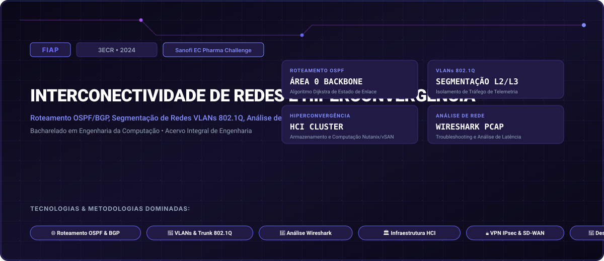

# FIAP • Interconectividade de Redes e Hiperconvergência (2024)

> **Engenharia da Computação — FIAP (Faculdade de Informática e Administração Paulista)**  
> **Turma:** 3ECR • Ano Letivo 2024  
> **Desafio Corporativo Integrado:** Sanofi EC Pharma Challenge  
> **Portal Interativo GitHub Pages:** [https://guimemee.github.io/fiap-interconectividade-de-redes-e-hiperconvergencia/](https://guimemee.github.io/fiap-interconectividade-de-redes-e-hiperconvergencia/)

---

## 📋 Sumário Executivo do Acervo

Este repositório consolida o acervo acadêmico integral e os projetos práticos de engenharia da disciplina **Interconectividade de Redes e Hiperconvergência**, contemplando:
1. **6 Checkpoints Oficiais (2024):** Enunciados integrais originais, memórias de cálculo passo a passo no padrão Symbolab e cadernos Jupyter (`.ipynb`) com gráficos executáveis.
2. **01_Apostilas_e_Teoria:** Livros didáticos, apostilas e slides de aulas.
3. **02_Exercicios_e_Laboratorios:** Listas práticas, scripts e códigos de laboratório.
4. **04_Global_Solution:** Desafios integradores semestrais da FIAP.
5. **05_Challenge_Sprints:** Sprints interdisciplinares de inovação corporativa (Sanofi EC Pharma Challenge).

---

## 🎯 6 Checkpoints Oficiais (2024)

- **Checkpoint 1:** Endereçamento IPv4/IPv6, Sub-redes VLSM e Planejamento Topológico &rarr; [`03_Provas_Avaliativas_Checkpoints/Checkpoint_1_cp1/Resolucao_Calculos.ipynb`](03_Provas_Avaliativas_Checkpoints/Checkpoint_1_cp1/Resolucao_Calculos.ipynb)
- **Checkpoint 2:** Segmentação com VLANs, Enlaces Tronco 802.1Q e Roteamento Inter-VLAN &rarr; [`03_Provas_Avaliativas_Checkpoints/Checkpoint_2_cp2/Resolucao_Calculos.ipynb`](03_Provas_Avaliativas_Checkpoints/Checkpoint_2_cp2/Resolucao_Calculos.ipynb)
- **Checkpoint 3:** Protocolo de Roteamento Dinâmico de Estado de Enlace: OSPFv2 &rarr; [`03_Provas_Avaliativas_Checkpoints/Checkpoint_3_cp3/Resolucao_Calculos.ipynb`](03_Provas_Avaliativas_Checkpoints/Checkpoint_3_cp3/Resolucao_Calculos.ipynb)
- **Checkpoint 4:** Análise Profunda de Tráfego e Resolução de Problemas com Wireshark &rarr; [`03_Provas_Avaliativas_Checkpoints/Checkpoint_4_cp4/Resolucao_Calculos.ipynb`](03_Provas_Avaliativas_Checkpoints/Checkpoint_4_cp4/Resolucao_Calculos.ipynb)
- **Checkpoint 5:** Infraestrutura Hiperconvergente (HCI) e Armazenamento Distribuído vSAN &rarr; [`03_Provas_Avaliativas_Checkpoints/Checkpoint_5_cp5/Resolucao_Calculos.ipynb`](03_Provas_Avaliativas_Checkpoints/Checkpoint_5_cp5/Resolucao_Calculos.ipynb)
- **Checkpoint 6:** Redes Definidas por Software (SD-WAN) e Túneis VPN IPsec Seguros &rarr; [`03_Provas_Avaliativas_Checkpoints/Checkpoint_6_cp6/Resolucao_Calculos.ipynb`](03_Provas_Avaliativas_Checkpoints/Checkpoint_6_cp6/Resolucao_Calculos.ipynb)

---

## 🏛️ Créditos e Rastreabilidade
- **Instituição:** FIAP (Faculdade de Informática e Administração Paulista)
- **Curso:** Bacharelado em Engenharia da Computação
- **Turma:** 3ECR • Ano Letivo 2024
- **Aluno:** Guilherme Macário da Silva ([@Guimemee](https://github.com/Guimemee))
